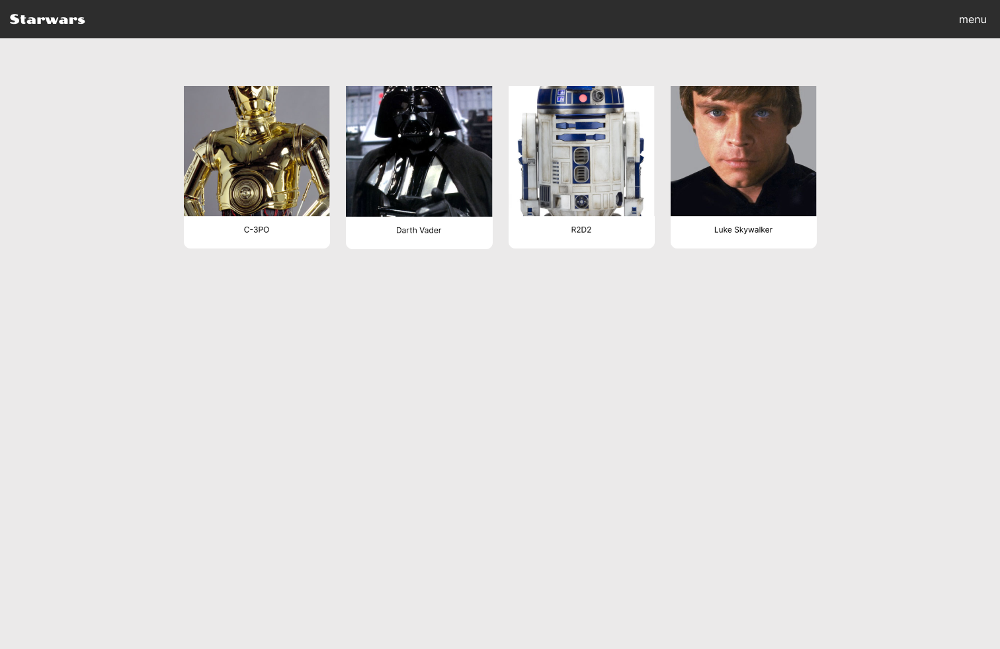

# Assignment 1
For the homework exercises we are using the Star Wars API. 

https://starwars-databank.vercel.app/

### HTML of things

---

Here are two designs for an application. Your task is to create the HTML version of these designs. Please select the most appropriate structural elements. There's no need to add JavaScript or CSS. The aim is to conceptualize in terms of HTML elements. So, layout and design are not important at this moment. 

HINT: one page with HTML elements would be fine.

